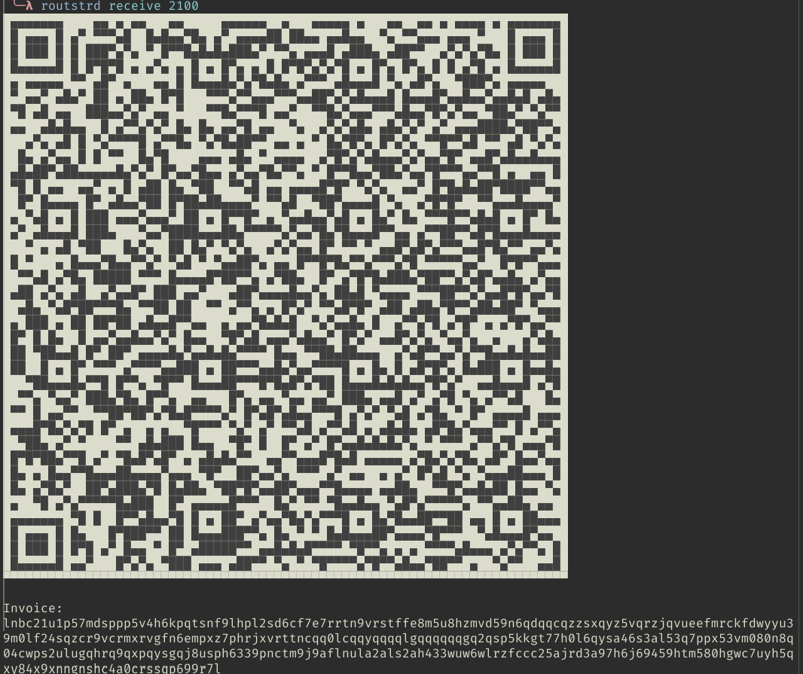
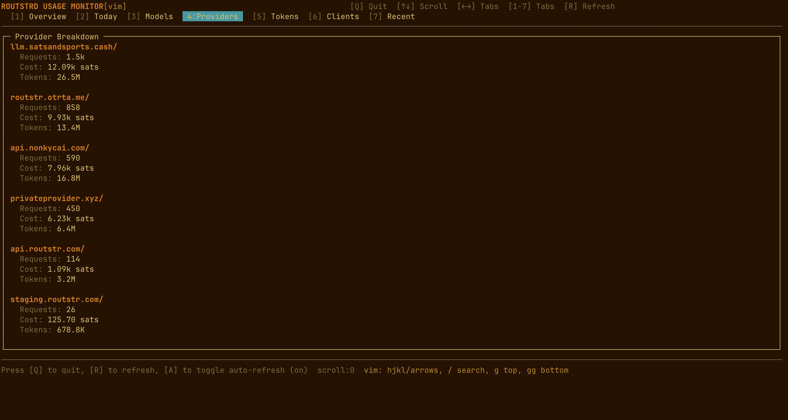
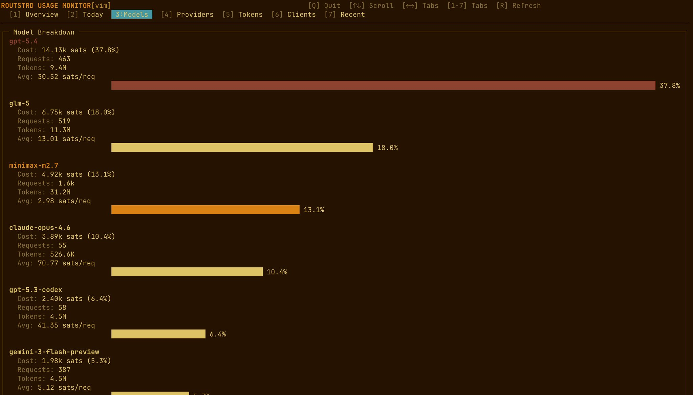

# Introducing Routstrd: The Nostr + Bitcoin Router for Permissionless AI

Routstrd is unlike any other inference provider out there. Because it's **not an inference provider** — it's a tool, powered by Nostr and Bitcoin, that works for *you*.

## What Is Routstrd?

Routstrd is a local daemon that turns your machine into an intelligent AI routing client for the Routstr decentralized network. It does three things automatically:

- **Constantly searches Nostr** for available Routstr/AI nodes
- **Finds the cheapest provider** for whichever model you want to use
- **Falls back to the next best node** based on availability and uptime

Because there's an open competition between Routstr nodes to offer the best price, latency, and uptime — you will never be disappointed. Right now there are **8-9 Routstr nodes** actively competing for your sats.

[](imgs/routstrd-announcement-1.png)

## Quick Start

Getting started takes just three commands:

```bash
bun install -g routstrd
routstrd onboard
routstrd receive 2100
```

During `routstrd onboard`, choose your favorite agent. **Claude Code**, **OpenCode**, **OpenClaw**, and **Pi Agent** have quick installations for now — but you can integrate Routstrd with any app on your machine.

The `receive 2100` command generates a Lightning invoice. Scan it, pay with your Lightning wallet, and you're ready to start your agent with 2,100 sats.

## Why This Matters

You don't need to yell at the big AI companies to stop harassing you with more and more requirements:

- ❌ No KYC
- ❌ No "tell us where you live"
- ❌ No "you can't use more than 100 prompts in 4 hours"
- ❌ No subscriptions or lock-in

**You have a choice now.**

[](imgs/routstrd-announcement-2.jpg)

## How It Works

Routstrd is powered by **[Cocod Wallet](https://github.com/lnsolar/cocod)** — a local wallet that handles all your Lightning payments. Routstrd pays for AI inference directly from this local wallet. It automatically switches to the cheapest available Routstr node and pays per use. No subscriptions. No commitments. Just sats.

[](imgs/routstrd-announcement-3.jpg)

The tool also ships with a **beautiful TUI** that keeps you up to date on what's happening — which nodes are available, pricing, uptime, and more.

## Available Models

Routstrd gives you access to state-of-the-art models at unbeatable prices:

- **GPT 5.5**
- **Deepseek V4 Pro**
- **Opus 4.7**
- **Kimi K2.6**
- And more — new models are added by node operators every week

Just scan a QR code, pay one Lightning invoice, and start using any of the most important technologies of the 21st century.

## The Competition Is Getting Heated

The competition between Routstr nodes is intensifying — which means **you're getting the best possible price for your sats**. Bitcoiners get the best price, and with Routstrd, Bitcoiners also get the best experience.

## Built for Bitcoiners, by Bitcoiners

Routstrd was battle-tested for a full month before release. The author used it as the primary daily driver to iron out every edge case.

This is built with ❤ for Bitcoiners, by Bitcoiners, with the help of **Nostr** and **Cashu**.

- **Source Code:** Available openly — powered by the [Routstr SDK](https://github.com/Routstr)
- **Cocod Wallet:** https://github.com/lnsolar/cocod

## As an Early User, You Power This Ecosystem

The more demand there is, the more supply there will be. Every sats you spend incentivizes more node operators to join the network, driving down prices and raising quality for everyone.

You should demand an experience where you can scan a QR code and start using cutting-edge AI immediately. **It's right here.**

---

If you face any issues, please reach out on Nostr. Tag the Routstr team or contributors.

**Built with ❤ for Bitcoiners, by Bitcoiners.**
